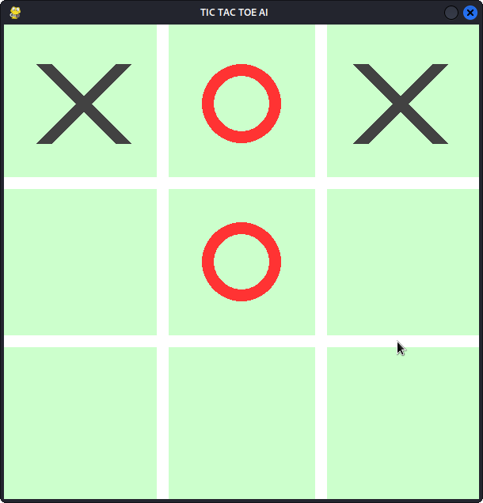

# TICTACTOE AI


## Description

This is an AI that plays tic-tac-toe. It's a simple game, but it's a good way to learn about AI. The AI uses a minimax algorithm to find the best move. The minimax algorithm is a recursive algorithm that evaluates each possible move and returns the best one.

## Picture



### Prerequisites

- Python 3

### Installation

1. Clone the repo

```sh
git clone https://github.com/d2bugs/tictactoe-ai/
```
2. Run main.py
```shell
python main.py
```
## Usage

> R to clear board. 

> C to change mode between 'PVP' & 'AI'. 

<br>

# Enjoy  :)

